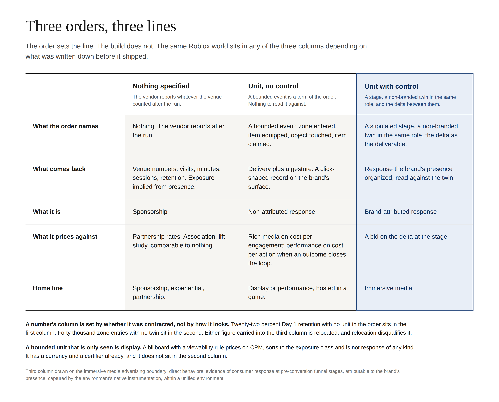

# The Immersive Line Is Written at the Order

Every number an immersive activation reports arrived after the run. Visits, minutes, average session, Day 7 retention, items claimed, percent of KPI. The figures are real, and none of them was a term of the order. **Nobody wrote the unit down before the build.** That is the whole diagnosis, and it is enough to sort every partnership-driven activation in the market.

A media buy names the evidence it will return before anything runs. That is what makes it a buy rather than a partnership. Immersive activations run first and report whatever the venue counted. In other words, the channel has been asking for a media line while skipping the one thing that puts a line in a plan.

The finding fits in one phrase a planner can run on any activation.

> No specified unit is sponsorship. A specified unit without a control is non-attributed response, priced as rich media or, with an outcome, as performance. A specified unit with a control is brand-attributed response, and it is the only thing on the immersive line.

## What a media buy specifies

**A media buy specifies its evidence unit as a term a second seller could answer.** A display insertion order names impressions, a viewability threshold, frequency and a price. A television buy names ratings points against a demographic. Search names the click. Affiliate names the action. Each channel names a different unit, and each names it before the campaign runs.

None of those channels promises an audience action nor a business outcome. Display specifies no response at all, and display is the largest media line in the plan. **What makes a buy media is that the unit was contracted in advance, counted by a method the buyer did not control, and comparable to the same unit from another seller.** Evidence quality is not the test. Specification is.

Podcasts show the sequence. Host-reads ran for a decade as partnership inventory, negotiated show by show, reported by the host, comparable to nothing, and brand spend stayed small. Dynamic insertion let a buyer write a flight a second network had to fill on the same terms, and the spend followed. **The format did not change across that transition. The buy term did.**

The unit a channel specifies is the thing that channel returns that nothing else can. Display's unit is the impression because exposure is what display produces. Immersive's unit is brand-attributed response, because direct behavioral evidence at pre-conversion stages is the only record no other channel can produce.

As a result, **the buy term for the immersive line is the response evidence itself**: a stage, a non-branded twin, and the delta between them. An order that specifies less is a media buy on another channel's terms. An order that specifies nothing is not a media buy.

## Three orders, three lines

The order sets the line. The build does not. The same Roblox world sits in any of the three columns depending on what was written down before it shipped.

**A number's column is set by whether it was contracted, not by how it looks.** Twenty-two percent Day 1 retention with no unit in the order sits in the first column. Forty thousand zone entries with no twin sit in the second. Either figure carried into the third column is relocated, and relocation disqualifies it.

## Nothing specified is sponsorship

**An activation with no unit in the order is sponsorship, however good the numbers look.** That is a classification, not a verdict on the build. Sponsorship reports the rights holder's audience, sells association, infers exposure from presence in the venue, and measures effect afterward by lift study. Every custom immersive report in circulation has that shape.

The reason is structural, not lazy. **Custom brand presence is unbounded, so no exposure unit can be drawn on it.** A billboard has edges, a pixel area and a time in view, which is why the intrinsic in-game guidelines can count an impression on it. A brand that is the world, the mechanic or the item has no edges. Exposure to the world is presence in the world, which is the visit count, which is the venue's number. Any box a vendor draws around the presence is a judgment about that execution, not a uniform unit.

As a result, the report carries no delivery receipt. It shows the brand was in the venue and the venue had an audience. It shows nothing about whether the audience reached the brand, let alone whether the brand moved it. **Sponsorship has never had a delivery receipt either; buying without one is its defining condition.** The label fits because the evidence matches, and the label matters because it moves the invoice from the media line to the partnership line.

## A unit without a control is non-attributed response

**A bounded event written into the order is a media unit, and that unit is a click.** A zone entered, an item equipped, an object touched, a drop claimed: each is delivery plus a gesture. The gesture is near the brand, not toward it. That is the exact record a click carries, and the open web prices it as a commodity for the exact reason a click cannot say what it was a response to.

Call it response. It is. **Non-attributed response is response reported without a non-branded equivalent in the same role.** The equivalent is the same surface with the brand taken out: the same zone, the same item, the same mechanic and the same reward, offered to the same population in the same environment, carrying no brand. Players respond to it too, because the zone is still worth entering and the item is still worth equipping. Whatever they do on that surface is the mechanic's share of the response. Whatever they do on the branded surface beyond it is the brand's share. The twin is what makes that subtraction possible.

Without the twin, the branded surface's number is both shares added together, and nothing in the record can tell them apart. **A vendor reporting that number is reporting the sum as if it were the brand's.** The word "response" concedes nothing here, because display already prices unattributed response every day, and prices it low. The qualifier is a checkable condition, not an adjective: a vendor claiming response evidence is asked for the twin, not argued with about vocabulary.

Session time is not a receipt for this tier or any other. A vendor offering minutes played as delivery is offering scroll time as proof the ad was served. **If the brand is the world, playing in the world is presence in the venue**, and the record is the first column's, not the second's.

The tier has a fork inside it, set by the outcome. **With an outcome that closes the loop, non-attributed response is direct response and prices on cost per action.** Rewarded video for installs, playables for downloads, in-game commerce with a logged transaction: each is direct response on direct response's conditions, funded from performance budgets and legitimate there. Without an outcome, the same record is rich media, priced on cost per engagement. A bounded unit that is only seen is display on CPM; it is exposure, not response, and it does not sit in this tier. Neither is immersive media. Neither carries a brand premium.

The tier also splits on whether a twin can exist. **A playable is non-attributed by construction: it has no environment, so there is no organizing presence, no native instrumentation and nothing to read against.** A bounded event inside a custom build is non-attributed by omission: the environment exists, the presence organizes a surface, and the twin is buildable. Only the second is one control away from the third column. Aimed at a playable, the same advice describes a step that does not exist.

A report that carries forty thousand zone entries has classified itself. **It records what a click records, and the brand could have bought forty thousand clicks against another benchmark.** The endemic claim is that something else happened between the player and the brand. It may have. The report contains no evidence of anything except delivery and a gesture, and a report caps the activation's value at what it chose to count.

## A unit with a control is the immersive line

**The immersive line begins where the order names attribution.** The pre-conversion stage is stipulated before the run. The baseline is a non-branded equivalent in the same role, either instrumented alongside the activation or known at referent grade, and never supplied by a party the delta grades. The delta at the stage is the deliverable, and the price is a bid against it. Nothing about the build is on the order. The record is.

The control is what the billboard's edges are for the impression. **Unbounded presence cannot receive a unit from a format or a certifier, so the brand authors the unit at the buy.** It names the surface its presence organizes, names the behaviors that count as stages on it, and names the twin that bounds attribution. That is why no external body will ever accredit this class: the gate is uniform and the instance is the brand's. The evidence is validated at the brand seat because that is the only seat it can be validated in.

The verdict is per surface, not per activation. **A single qualified surface, inside a larger build, is immersive; the rest of the build does not qualify by relation.** A branded item equipped against an unbranded equivalent is on the immersive line. The world it sits in, uninstrumented, is on the partnership line. A rewarded video slot the platform sells in the same world is display, and stays display. Three lines, one venue, and nothing passes between them. The brand crosses with the part it chose to bound.

The cost of the third column is a control. **The premium belongs to the activations that build one.** Every other number an environment produces describes response to the surface, and the surface is priced by the column it recorded in.

## The check to run

Two questions sort any partnership-driven build, and both are answered from the order, not the debrief. **Was the unit a term before anything was built? What was the twin?**

No unit in the order: sponsorship. Book it on the partnership line at partnership rates. A unit and no twin: non-attributed response. Compare it to display's price for the same record, and tell the vendor the surface is one control from its own line. A unit and a twin: the immersive line, priced on the delta.

All three lines are valid. It is invalid to price a line that wasn't specified. The line was never missing from the plan. It was missing from the order.
