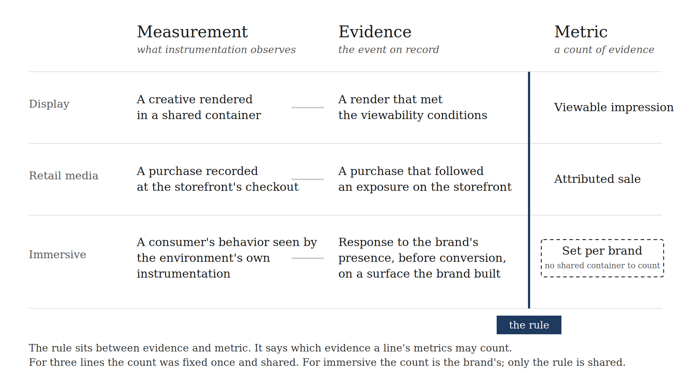

# The Only Rule Gaming Is Missing

Brand spend has never scaled for a format. It has scaled every time a line appeared with a rule for what evidence a buy on that line returns. Three of the IAB's gaming measurement framework's four columns already had that rule, inherited from the channels they belong to. The fourth was filled with counts and never given one. A column without a rule is a list of formats, which is the one thing brand spend has never followed.
***

Every time brand spend has scaled into a new place, the same thing happened first. A line appeared, and the line came with a rule for the evidence a buy on it returns. Retail media returned observed purchases. Podcasts returned certified downloads. Rewarded video returned the install its buyer could see. The formats inside each line were not new; banners, host-reads, and video units all predated the money. The rule made the formats legitimate, and the spend scaled with the rule.

The reverse has never happened. Rich media, expandable banners, native units, six-second bumpers, shoppable spots: each was a better format than what it replaced, each left the evidence a buy returned unchanged, and none scaled brand budgets. Better formats with the same rule beneath them are the same line with nicer creative. In other words, a planner allocates to a rule, not to a format, and a category that offers formats without a rule offers the planner nothing to allocate to.

That is the condition the gaming investment gap describes. For three of its four columns the gaming measurement framework already tells a planner what a buy returns. Display in games returns what display returns. Video in games returns what video returns. Those rules were inherited, and the spend on those lines is already where the rules put it: inside display and video budgets, growing at the rate display and video grow. The audience gap cannot close on lines that are already closed. Nothing in them offers a planner an evidence class they do not already buy elsewhere.

The fourth column is the only place gaming offers something new. The environments inside it observe consumer response before conversion, on surfaces the brand builds — an evidence class no other line returns. That is where the growth story is, and it is the one column with no rule. So the gap is wide in dollars and narrow in cause: one rule, for one channel, that nobody has written. Closing it is not a matter of confidence or education. It is a matter of writing the rule.

## Measurement, evidence, metric
The industry uses one word, measurement, for three things. Keeping them apart is essential.

Measurement is the observation of an event. A pixel fires when a creative renders. A player reports that a video stream reached its end. A checkout records a purchase. Measurement is what the instrumentation sees.

Evidence is the event on record. It is what observation yields: a render that met the viewability conditions, a purchase that followed an exposure, a consumer's action inside a branded space. Evidence is the observed event, not a number.

A metric is a count of evidence. The viewable impression counts qualifying renders. The attributed sale counts qualifying purchases. A metric can only count what measurement observed and the rule admitted.

The rule sits between the second term and the third. A channel's rule says which evidence a line's metrics may count. It does not name the number; it names what the number is allowed to be a number of. Display's rule admits renders. Video's admits completions. Retail media's admits purchases the environment saw. Before an objective is typed, a planner knows the class of event coming back, because the rule settled it. That knowledge is what a planner allocates to. The count comes after, and the count is admissible only because the rule admitted it.

Display's history fused all three terms into "the impression," which is why "measurement" came to mean the number. Immersive media forces them back apart. Its measurement already exists: the environments run their businesses on native instrumentation that observes consumer behavior. Its evidence is defined: response to the brand's presence, before conversion. What it lacks is the rule that admits that evidence onto a line — and without the rule, the metrics it produces are counts of nothing a planner can allocate to.

## In shared containers the rule collapses into a count
Display, video, and audio are bounded by what the ad is. A creative rendered in a slot is display. A stream with a play head is video. The ad's form draws the line, and the ad sits in a container — a page, a player, a stream — that is the same for every advertiser who buys it.

That sameness is what let the rule disappear. When the container is shared, the rule collapses into a single count. The viewable impression is both the rule and the number: "display returns rendered exposure in a container" and "a render that met the viewability conditions" became one object, defined once, accredited everywhere. Nobody ever had to write display's rule down, because the count was the rule.

That is why a display boundary sounds like a metric if you look at it long enough. It is not that display lacks a rule. It is that the rule fused with its count so early that the industry stopped seeing two things. The fusion is an accident of the shared container, not a property of rules.

## Retail media wrote a new rule and got a count
Retail media is the cleanest recent case of spend following a rule. The formats were banners. The placements were display placements. Nothing about the ad (format) changed. What changed was the event a buy could count: the environment observed the purchase, so a buy inside it returned an attributed sale. The rule was drawn by what the environment produced, not by what the ad was. Spend followed the new rule, and the banners inside the line inherited its legitimacy.

Retail media still got a count, and the reason is the same as display's. The retailer's storefront is a shared container. Every advertiser's banner sits in the same catalog, against the same checkout, observed by the same instrumentation. So the rule — this environment returns observed purchase — collapsed into a currency the line could trade on. The line got a rule and a count at once, because the container let it.

## Immersive's rule cannot collapse
Immersive media's rule is drawn the way retail media's was, by what the environment produces. It admits environments that produce direct behavioral evidence of consumer response at pre-conversion funnel stages, attributable to the brand's presence, captured by native instrumentation, within a unified environment. Four conditions, and all four describe the event: a consumer responding to the brand's presence, before conversion, observed by the environment's own instrumentation. An environment is in the channel if it produces that event and out if it does not.

What immersive does not have is a shared container. The brand occupies a bespoke surface, so the event consumers respond to is unique to the brand that built it. There is no common slot for a count to be of. As a result, the rule cannot fuse with a number the way display's and retail media's did. It stays visible as a rule, and the counts beneath it stay specific to each brand.

That is not a defect of the channel. Two advertisers pass through the same rule and count different events — one an in-world action, another item adoption, a third return rate to a branded space. The rule is uniform. The count is the brand's. Immersive is not an exception to how channel rules work. It is the case that shows what they always were, because it is the first channel where the rule and the count can be seen apart.

## The rule is applied three times and is never a count
The rule does not stop at qualification. It recurs at specification, where a vendor commits to deliver evidence of the admitted class against a threshold the brand sets. It recurs at acceptance, where delivered evidence is checked against the class and the threshold before payment. The same rule, three applications.

At none of the three does the rule become a metric. An acceptance criterion is not a KPI. It is the condition under which a KPI is eligible to be reported. Every RFP in every channel carries acceptance criteria, and nobody mistakes them for the numbers they govern. Immersive's rule works the same way: it says which kinds of numbers may satisfy the contract.

## The column the framework left empty
IAB's gaming measurement framework sorted every gaming format into a column and put counts beneath each. Display, video, and audio took their counts from the channels they belonged to, and the counts arrived with their rules already fused. The fourth column, labeled Custom, took impressions, viewability, reach, and frequency from display, brand lift from television, and "custom KPIs" from nowhere. The column was filled with borrowed counts because it had no rule of its own to fill it.

The framework did not skip the rule out of carelessness. For three columns it had never needed one. Its method — defer to the native standard — worked because deference to a count is deference to its rule. For the fourth column no count existed and no rule waited to be deferred to, because immersive's rule had never been written by anyone. The one step the framework had never had to perform was the only step available.

"Custom KPIs" is the framework saying so in its own words. A row that had a rule would name the event its metrics count. A row that had a count would name the count. Custom names neither. It names a condition: built to order, measured however the builder reports.

The economics of that condition are already visible. A partnership is what a seller offers when there is no rule to sell against. The actors inside Custom price on relationship, report on metrics of their choosing, and compare to nothing, because the row gives them nothing else to price on. The formats have been available for years. Spend has reached them and stalled, for the same reason it stopped at rich media: the rule is missing, and spend does not scale on a format.

## The finding
Brand spend follows a rule. In every channel that has a currency, the rule collapsed into a count because the container was shared. Immersive's container is bespoke to the brand, so its rule stays a rule and its counts stay per brand. That is the whole difference, and it is a difference at the metric layer only. At the rule — the layer a planner allocates to — immersive is on the same footing as every line that has ever scaled brand spend.

The fourth column is not empty because immersive cannot be measured. It is empty because the framework can only write counts, and for this row the count comes after the rule. The framework owes the row a header, not a ninth metric. The header is the rule.

Write the rule, and a line exists that brand spend can scale on, the way it scaled on every rule before it. Fill the column instead, and the framework will have catalogued the formats one more time, measured the venue one more time, and left the gap exactly where it found it.