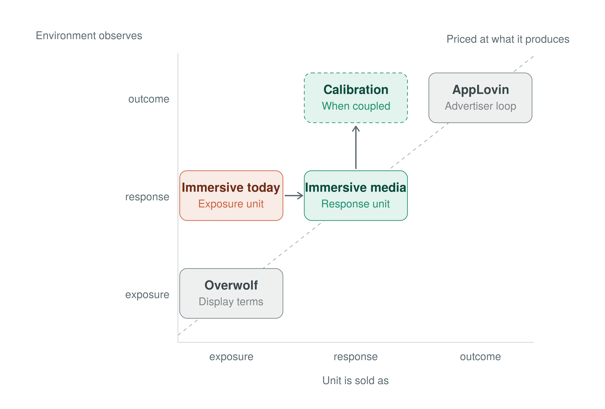

# Immersive Holds Half A Loop
A note on where immersive media sits between the two positions the market has already priced, and why an outcome record on its own cannot lift it out of the exposure column.
***
 
The market has already priced the two ends of the evidence scale, and it priced them by grade of evidence, not size of audience. Overwolf sells exposure to a gaming audience on display terms. It doubled in-game ad sales to $100 million in 2024 by plugging into The Trade Desk, and it has not raised a round since 2021. AppLovin sells outcomes to buyers who bring their own outcome record. It reported $1.92 billion of revenue in the June quarter, and it sold all ten of its game studios to concentrate on the engine. One is a supply source. The other is a loop. Nothing in between has been rewarded, because nothing in between has been specified.
 
Immersive sits in that gap. Its environments observe direct behavioral response to a brand's presence, at pre-conversion stages, inside one surface. That grade of evidence is higher than exposure and lower than a purchase. Exposure is native to every environment. Outcomes are fed in by the advertiser. Response is the only grade above exposure that an environment produces on its own. Immersive holds the one native position above exposure on the scale, and it is the position nobody has priced.
 
Today it is sold as an exposure unit. Roblox's measurement stack states this plainly. Viewability and invalid-traffic verification from IAS. Forced-exposure brand lift from Kantar. Reach and frequency from Nielsen. In June, an outcomes partnership with EDO that reads lift in branded search during an event window against the brand's baseline from adjacent weeks. Every layer measures either exposure or a downstream signal produced outside the environment. The platform with the richest native instrumentation in media went outside its own environment to find something it could call an outcome. That is what the exposure column looks like from the inside.
 
Roblox is one platform capable of housing immersive media. It is not the category. Fortnite is another. A properly instrumented live service game is another, and so is any environment that observes what players do around a brand's presence inside one surface. The boundary is set by what the environment can observe, not by which platform hosts it or whether its content is user-generated. As a result, the exposure column Roblox occupies is the column the whole class occupies today, and the case that shows the other half of a loop comes from a different platform.
 
The Fortnite account-linking rewards show what the other half of a loop looks like when it exists without the first half. Link an Epic account to a MyDisney account, and a Disney+ login qualifies, and a Star Wars item unlocks in Fortnite: a First Order Stormtrooper outfit in 2025, a Carbonite Fishstick back bling in 2026, claimable to the end of October. Link a LEGO account and two outfits unlock with LEGO styles. Epic's own help page states that linking includes data sharing between Epic and Disney, reviewed on both sides. The mechanic couples an in-environment reward gate to a brand-side outcome record. Disney observes every account created or signed in through the link. That is a calibration coupling, built into the activation by design.
 
On its own, the outcome record falls flat. It counts links. It cannot say what preceded a link. A player who linked because of the outfit and a player who linked because of the brand produce the same record. In other words, the link is exposure plus a gesture, and a gesture near a brand is not evidence of response to it. That is the same defect as a click, relocated to a subscription service. A calibration is a relation between two terms, and Disney holds one. No published result relates the link to anything that happened in the environment before it, because nothing in the environment was specified to be observed.
 
Pre-conversion observation is the missing term, and it qualifies by itself. Inside Fortnite, a player who approaches the Star Wars content, equips the item, carries it into matches and returns to it across sessions has produced a sequence of behaviors on a surface the brand's presence organises. Each behavior is attributable to that presence by where it happened, not by who did it. No identifier is required. That sequence is admissible response evidence with its strength unmeasured, and an activation that reports it and stops has produced a complete result. Nothing in display, social or search produces it, because none of those surfaces observe more than one gesture.
 
With the link in place, the same observation becomes the anchor that gives the outcome its meaning. The relation reads which observed behaviors preceded a link, and at what rate. Equipping predicted linking, or it did not. Returning predicted linking, or it did not. The result is a strength figure for each gate, reported in the outcome position and labelled by the record it was read against, which here is brand-instrumented. The outcome calibrates the strength of a response the environment already observed. It never replaces the response, and it never enters the response slot as demand. Disney would end up with the one thing its link count cannot give it: the ability to relate an in-environment behavior to an account on its own books, without tracking a single player across systems.
 

 
The diagram makes the two verdicts the market has issued legible. Value climbs the diagonal with the grade of evidence sold. Overwolf is honestly priced and cheap. AppLovin is honestly priced and expensive, and its outcome row is fed by the advertiser, which is why it takes no brand buyer who cannot feed it. AppLovin is a calibration relation with no native response observed beneath it. Immersive is the reverse: native response with no relation run above it. Fortnite is the case where the coupling for that relation already exists and the first term was never observed.
 
That is the finding. Immersive's route to AppLovin's row does not run through a pixel, because the buyers immersive serves do not have one to give. It runs through the observation the environment already produces, specified as a unit, sold as response, and calibrated against whatever outcome the activation was built to couple to. The Disney link is the second term of a loop that nobody wrote the first term for. Write the first term and the link stops being a count of gestures and becomes the strength reading on a response the environment saw. Leave it unwritten and Fortnite keeps holding half a loop, and immersive keeps being sold from the column it was never confined to.
 
Sources
 
Overwolf doubled in-game ad sales to $100 million in 2024: Variety, via AOL, "Video Game Adtech Company Overwolf Doubles In-Game Ad Sales to $100 Million in 2024" — https://www.aol.com/video-game-adtech-company-overwolf-143257336.html
Overwolf as the first gaming publisher on The Trade Desk's OpenPath: Overwolf blog — https://blog.overwolf.com/overwolf-partners-with-the-trade-desk-to-bring-advertisers-exclusive-gaming-inventory-through-openpath-integration
Overwolf's last round, a $75 million Series D in November 2021, with about $150 million raised in total: Globes — https://en.globes.co.il/en/article-israeli-gaming-platform-overwolf-raises-75m-1001391316 ; CB Insights — https://www.cbinsights.com/company/overwolf/financials
AppLovin second-quarter 2026 revenue of $1,924 million: AppLovin Form 8-K, Exhibit 99.1, August 5, 2026 — https://www.sec.gov/Archives/edgar/data/0001751008/000175100826000057/exhibit991-2q26earningspre.htm
AppLovin's sale of its ten game studios to Tripledot Studios, closed June 30, 2025: Business Wire — https://www.businesswire.com/news/home/20250701033978/en/AppLovin-Completes-Sale-of-Mobile-Gaming-Business-to-Tripledot-Studios
IAS viewability and invalid-traffic measurement on Roblox: Integral Ad Science — https://integralads.com/insider/first-to-market-roblox-measurement
Kantar Context Lab forced-exposure brand lift as Roblox's interim solution: Daily Research News Online, May 2, 2024 — https://www.mrweb.com/drno/printable/pn36652.htm
Roblox measurement partners including Cint, Kantar and Nielsen ONE (reach and frequency): Roblox newsroom, April 2025 — https://about.roblox.com/pl/newsroom/2025/04/roblox-scales-video-ads-partners-with-google
Roblox and EDO partnership, announced June 18, 2026, including the search-lift method for branded events: Roblox newsroom — https://about.roblox.com/newsroom/2026/06/roblox-ipsos-edo-immersive-effective-measurement-partnerships-cannes-lions ; EDO — https://www.edo.com/resources/roblox-gaming-ad-outcomes
Fortnite MyDisney account linking, 2025 First Order Stormtrooper reward and its extension to October 31, 2025: Epic Games Support — https://www.epicgames.com/help/c-202300000001636/c-202300000001721/how-do-i-get-the-first-order-stormtrooper-outfit-and-rewards-a202300000010316
Fortnite MyDisney account linking, 2026 Carbonite Fishstick reward, the November 1, 2026 date, and the data-sharing note: Epic Games Support — https://www.epicgames.com/help/en-US/c-Category_EpicAccount/c-ConnectedAccounts/how-do-i-link-mydisney-account-to-my-epic-games-account-a000094484
Fortnite LEGO account linking, Explorer Emilie and Mr Dappermint outfits: Fortnite news, December 7, 2023 — https://fortnite.com/news/connect-your-epic-and-lego-accounts-get-a-free-fortnite-outfit